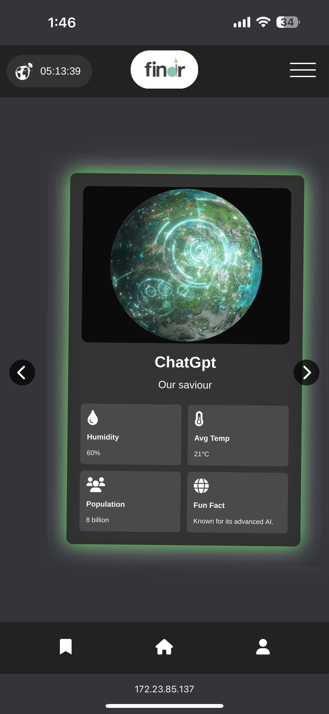

# Finder 



Finder is a unique web application inspired by Tinder, where you can save planets by swiping right. Access your saved planets and learn more about the cosmos while contributing to the ultimate theme of escaping Earth.

## Project Overview

This project was created as part of a hackathon organized by SESA x WDCC. The theme of the hackathon was "Escaping Earth." It was our team's first ever hackathon, and we were thrilled to receive the secret category prize for the most entertaining solution.

## Team

**Team Name:** `print("hello world")`

### Team members
- Andre Camerino
- Evan Au
- Jayden Newport
- Ashlee Shum
- Gabrielle Esguerra
- Lucas Fontaine

## Features

- Swipe right to save planets
- Access and view your saved planets
- Learn interesting facts about each planet

## Awards

- Secret Category Prize for Most Entertaining Solution

## Hackathon Details

- **Organizers:** SESA x WDCC
- **Theme:** Escaping Earth

## Installation

To run this project locally:

1. Clone the repository
   ```sh
   git clone https://github.com/your-username/finder.git
